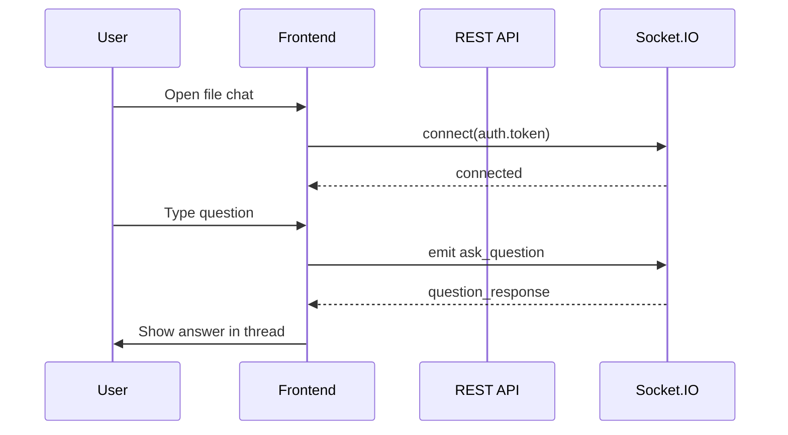

# Doc-sense-AI — Frontend Integration Guide

This document describes every REST API and Socket.IO event for frontend integration, plus recommended UI pages and design direction.

**Base URL (local):** `http://localhost:8000` (or your deployed host)  
**Socket.IO path:** `/socket.io`  
**Production ASGI entrypoint:** `uvicorn main:socket_app` (REST + Socket.IO on the same origin/port)

---

## Table of contents

1. [Authentication & headers](#1-authentication--headers)
2. [Standard response envelope](#2-standard-response-envelope)
3. [REST APIs](#3-rest-apis)
4. [Socket.IO real-time API](#4-socketio-real-time-api)
5. [UI pages & design recommendations](#5-ui-pages--design-recommendations)

---

## 1. Authentication & headers

| Concern | Detail |
|--------|--------|
| Access token | JWT returned from **Sign in** |
| Protected REST routes | `Authorization: Bearer <access_token>` |
| Token refresh | `POST /api/v1/token/generate-access-token` with refresh token |
| Logout | Blacklists both access and refresh tokens |

**Password rules (sign-up, change/reset password):**  
Minimum 8 characters, at least one uppercase, one lowercase, one digit, and one special character from `@$!%*?&`.

**Email rules:** Standard email format; duplicate email on sign-up returns **406**.

---

## 2. Standard response envelope

Most endpoints return a wrapped `APIResponse`:

```json
{
  "success": true,
  "message": "Human-readable message",
  "error": null,
  "data": { }
}
```

**Error responses** (from global exception handlers):

```json
{
  "success": false,
  "message": null,
  "error": "Error detail string",
  "data": null
}
```

| HTTP status | Typical cause |
|-------------|----------------|
| 400 | Validation / business rule failure |
| 401 | Missing, invalid, or expired token |
| 403 | Forbidden (e.g. expired reset token) |
| 404 | Resource not found |
| 406 | Email already registered |
| 422 | Invalid request body / form (returns `INVALID_REQUEST_PAYLOAD`) |
| 500 | Unhandled server error (`UNEXPECTED_ERROR_MESSAGE`) |

**Exception — Sign in:** Returns a **flat token object** (not wrapped in `APIResponse`). See [3.2 Sign in](#32-sign-in).

---

## 3. REST APIs

### 3.1 Health check

| | |
|---|---|
| **Method / path** | `GET /health-check` |
| **Auth** | None |

**Success (200)**

```json
{
  "message": "Hello World"
}
```

---

### 3.2 Sign in

| | |
|---|---|
| **Method / path** | `POST /api/v1/user/sign-in` |
| **Auth** | None |
| **Content-Type** | `application/x-www-form-urlencoded` (OAuth2 password flow) |

**Request body (form fields)**

| Field | Type | Required | Notes |
|-------|------|----------|-------|
| `username` | string | Yes | User **email** (OAuth2 uses `username`, not `email`) |
| `password` | string | Yes | |
| `scope` | string | No | Optional OAuth2 scope |
| `client_id` | string | No | |
| `client_secret` | string | No | |

**Example**

```
username=manav@gmail.com&password=Manav@123456
```

**Success (200)** — direct `Token` body (no `success` wrapper)

```json
{
  "access_token": "eyJ...",
  "refresh_token": "eyJ...",
  "task_id": null,
  "user_id": "550e8400-e29b-41d4-a716-446655440000",
  "first_name": "Manav",
  "last_name": "Patel",
  "email": "manav@gmail.com"
}
```

**Error responses**

| Status | `error` / detail |
|--------|------------------|
| 400 | `INVALID_EMAIL` or `INVALID_PASSWORD` |
| 401 | `Email id or password is incorrect, try again` |
| 404 | `User not found` |

---

### 3.3 Sign up

| | |
|---|---|
| **Method / path** | `POST /api/v1/user/sign-up` |
| **Auth** | None |
| **Content-Type** | `application/json` |

**Request body**

```json
{
  "first_name": "Manav",
  "last_name": "Patel",
  "email": "manav@gmail.com",
  "password": "Manav@123456"
}
```

| Field | Type | Required |
|-------|------|----------|
| `first_name` | string | Yes |
| `last_name` | string | Yes |
| `email` | string | Yes |
| `password` | string | Yes |

**Success (201)**

```json
{
  "success": true,
  "message": "Account created successfully !",
  "error": null,
  "data": null
}
```

**Error responses**

| Status | Detail |
|--------|--------|
| 400 | Invalid email or password format |
| 406 | `User with {email} already exists` |

---

### 3.4 Get profile

| | |
|---|---|
| **Method / path** | `GET /api/v1/user/profile` |
| **Auth** | Bearer access token |

**Success (200)**

```json
{
  "success": true,
  "message": "Profile retrieved successfully",
  "error": null,
  "data": {
    "first_name": "Manav",
    "last_name": "Patel",
    "email": "manav@gmail.com"
  }
}
```

**Error responses**

| Status | Detail |
|--------|--------|
| 401 | `Not authorized to perform this action, please Sing-in again !` |

---

### 3.5 Update profile

| | |
|---|---|
| **Method / path** | `PATCH /api/v1/user/update-profile` |
| **Auth** | Bearer access token |
| **Content-Type** | `application/json` |

**Request body** (at least one field required)

```json
{
  "first_name": "Manav",
  "last_name": "Updated"
}
```

| Field | Type | Required |
|-------|------|----------|
| `first_name` | string | No |
| `last_name` | string | No |

**Success (200)**

```json
{
  "success": true,
  "message": "User data updated successfully !",
  "error": null,
  "data": null
}
```

**Error responses**

| Status | Detail |
|--------|--------|
| 400 | `There is no data to update` / `Name can only contain alphabets` |
| 401 | Not authorized |
| 404 | `User not found` |

---

### 3.6 Change password (logged in)

| | |
|---|---|
| **Method / path** | `PATCH /api/v1/user/change-password` |
| **Auth** | Bearer access token |
| **Content-Type** | `application/json` |

**Request body**

```json
{
  "current_password": "OldPass@123",
  "new_password": "NewPass@1234",
  "confirm_password": "NewPass@1234"
}
```

**Success (200)**

```json
{
  "success": true,
  "message": "Password changed successfully !",
  "error": null,
  "data": {
    "sign-in app": "<SIGN_IN_URL from server env>"
  }
}
```

After success, the current access token is **blacklisted** — user must sign in again.

**Error responses**

| Status | Detail |
|--------|--------|
| 400 | Password validation / mismatch / same as old password |
| 401 | `Current password is incorrect` |
| 404 | `User not found` |

---

### 3.7 Forgot password

| | |
|---|---|
| **Method / path** | `POST /api/v1/user/forgot-password` |
| **Auth** | None |

**Request body**

```json
{
  "email": "manav@gmail.com"
}
```

**Success (200)**

```json
{
  "success": true,
  "message": "Email has been sent for password reset",
  "error": null,
  "data": null
}
```

> **Note:** Email sending is currently commented out in the backend; the API still returns success when the user exists.

**Error responses**

| Status | Detail |
|--------|--------|
| 404 | `User not found` |

---

### 3.8 Reset password (forgot-password flow)

| | |
|---|---|
| **Method / path** | `POST /api/v1/user/reset-password?token=<reset_token>` |
| **Auth** | None |
| **Content-Type** | `application/json` |

**Query parameters**

| Param | Required | Description |
|-------|----------|-------------|
| `token` | Yes | Token from reset email link |

**Request body**

```json
{
  "new_password": "NewPass@1234",
  "confirm_password": "NewPass@1234"
}
```

**Success (200)**

```json
{
  "success": true,
  "message": "Password changed successfully !",
  "error": null,
  "data": null
}
```

**Error responses**

| Status | Detail |
|--------|--------|
| 400 | Invalid password / passwords do not match |
| 403 | `This token has expired` |
| 404 | `User not found` |

---

### 3.9 Logout

| | |
|---|---|
| **Method / path** | `POST /api/v1/user/logout` |
| **Auth** | Bearer access token |
| **Content-Type** | `application/json` |

**Request body**

```json
{
  "access_token": "<current_access_token>",
  "refresh_token": "<current_refresh_token>"
}
```

**Success (200)**

```json
{
  "success": true,
  "message": "Logout successful",
  "error": null,
  "data": null
```

**Error responses**

| Status | Detail |
|--------|--------|
| 401 | `Invalid token or user has already logged out` |

---

### 3.10 Verify access token

| | |
|---|---|
| **Method / path** | `POST /api/v1/token/verify-access-token` |
| **Auth** | None |
| **Content-Type** | `application/json` |

**Request body**

```json
{
  "token": "<access_token>"
}
```

**Success (200)**

```json
{
  "success": true,
  "message": "Token is valid",
  "error": null,
  "data": null
}
```

**Error responses**

| Status | Detail |
|--------|--------|
| 401 | `Invalid access token !` |

---

### 3.11 Generate new access token (refresh)

| | |
|---|---|
| **Method / path** | `POST /api/v1/token/generate-access-token` |
| **Auth** | None |
| **Content-Type** | `application/json` |

**Request body**

```json
{
  "token": "<refresh_token>"
}
```

**Success (200)**

```json
{
  "success": true,
  "message": "Tokens created successfully",
  "error": null,
  "data": {
    "access_token": "eyJ...",
    "refresh_token": "eyJ...",
    "token_type": "bearer"
  }
}
```

> `data.refresh_token` is the **same** refresh token you sent (not rotated).

**Error responses**

| Status | Detail |
|--------|--------|
| 401 | `Refresh token is invalid, Please sing-in in the application.` |

---

### 3.12 Upload file

| | |
|---|---|
| **Method / path** | `POST /api/v1/dashboard/file-upload` |
| **Auth** | Bearer access token |
| **Content-Type** | `multipart/form-data` |

**Request (form)**

| Field | Type | Required | Notes |
|-------|------|----------|-------|
| `file` | file | Yes | **PDF only** (`.pdf`) |

**Success (201)**

```json
{
  "success": true,
  "message": "File uploaded successfully !",
  "error": null,
  "data": {
    "id": "550e8400-e29b-41d4-a716-446655440000",
    "file_name": "report_550e8400-e29b-41d4-a716-446655440000.pdf",
    "status": "pending",
    "created_at": "2026-05-19T10:30:00Z",
    "uploaded_by": {
      "user_id": "550e8400-e29b-41d4-a716-446655440000",
      "first_name": "Manav",
      "last_name": "Patel"
    }
  }
}
```

RAG ingestion runs in the **background** after upload; `status` may change as processing completes.

**Error responses**

| Status | Detail |
|--------|--------|
| 400 | `Invalid file type. Please upload pdf file.` / upload validation failure |
| 401 | Not authorized |

---

### 3.13 List uploaded files (paginated)

| | |
|---|---|
| **Method / path** | `GET /api/v1/dashboard/get-file-upload-history` |
| **Auth** | Bearer access token |

**Query parameters**

| Param | Default | Notes |
|-------|---------|-------|
| `page` | `1` | Min 1 |
| `page_size` | `20` | Min 5 (server clamps) |

**Success (200) — with files**

```json
{
  "success": true,
  "message": "File Upload History",
  "error": null,
  "data": {
    "file_list": [
      {
        "id": "550e8400-e29b-41d4-a716-446655440000",
        "file_name": "report_550e8400.pdf",
        "status": "pending",
        "created_at": "2026-05-19T10:30:00Z",
        "uploaded_by": {
          "user_id": "...",
          "first_name": "Manav",
          "last_name": "Patel"
        }
      }
    ],
    "meta": {
      "total": 42,
      "page": 1,
      "page_size": 20,
      "total_pages": 3
    }
  }
}
```

**Success (200) — empty history**

```json
{
  "success": true,
  "message": "No file history found.",
  "error": null,
  "data": {}
}
```

**Error responses**

| Status | Detail |
|--------|--------|
| 401 | Not authorized |
| 500 | Server error |

---

### 3.14 Get file by ID

| | |
|---|---|
| **Method / path** | `GET /api/v1/dashboard/get-file-by-id/{upload_file_id}` |
| **Auth** | Bearer access token |

**Path parameters**

| Param | Type | Description |
|-------|------|-------------|
| `upload_file_id` | UUID | File record ID |

**Success (200)**

```json
{
  "success": true,
  "message": "File Upload History",
  "error": null,
  "data": {
    "id": "550e8400-e29b-41d4-a716-446655440000",
    "file_name": "report_550e8400.pdf",
    "status": "pending",
    "created_at": "2026-05-19T10:30:00Z",
    "uploaded_by": { "user_id": "...", "first_name": "...", "last_name": "..." }
  }
}
```

**Error responses**

| Status | Detail |
|--------|--------|
| 401 | `You dont have enough permissions to access this file` |
| 404 | `File history not found` |

---

### 3.15 Ask question about a file (REST — alternative to Socket)

| | |
|---|---|
| **Method / path** | `POST /api/v1/rag/question` |
| **Auth** | Bearer access token |
| **Content-Type** | `application/json` |

**Request body**

```json
{
  "file_id": "550e8400-e29b-41d4-a716-446655440000",
  "question": "What is the main topic of this document?"
}
```

| Field | Type | Required |
|-------|------|----------|
| `file_id` | UUID | Yes |
| `question` | string | Yes |

**Success (200)**

```json
{
  "success": true,
  "message": "Response generated successfully",
  "error": null,
  "data": {
    "response": "<LLM answer string>"
  }
}
```

**Error responses**

| Status | Detail |
|--------|--------|
| 401 | Not authorized |
| 500 | RAG / model errors (generic unexpected error) |

> For chat UX with streaming feel, prefer **Socket.IO `ask_question`** (Section 4). REST is suitable for one-shot Q&A or fallback.

---

## 4. Socket.IO real-time API

### 4.1 Connection

| Setting | Value |
|---------|--------|
| URL | Same host as API (e.g. `http://localhost:8000`) |
| Path | `socket.io` |
| Transports | WebSocket preferred; polling fallback supported |

**Authentication**

Pass the JWT **access token** at connect time. Integration tests use:

```javascript
import { io } from "socket.io-client";

const socket = io(API_BASE_URL, {
  path: "/socket.io",
  auth: { token: accessToken },
});
```

> **Backend note:** `app/realtime/auth.py` currently reads `HTTP_ACCESS_TOKEN` from the handshake environment. If connect fails with a valid token, also try passing the header (e.g. `extraHeaders: { "Access-Token": accessToken }`) or align the backend to read `auth.token` from the handshake payload.

**Connection refused**

- Invalid / missing / expired token → connection rejected (`ConnectionRefusedError`).

---

## 4.2 Event reference

#### Server → Client (automatic on connect)

| Event | When | Payload |
|-------|------|---------|
| `connected` | After successful auth | `{ "sid": "<socket_id>", "user_id": "<uuid string>" }` |

The server also auto-joins the socket to room `user_{user_id}`.

---

#### Client → Server: `join_channel`

Join a named room (e.g. for broadcasts).

**Emit payload**

```json
{
  "channel_id": "broadcast_room"
}
```

| Field | Required | Notes |
|-------|----------|-------|
| `channel_id` | Yes | Room name. `user_{uuid}` rooms are restricted to that user. |

**Server → Client responses**

| Event | Payload | Condition |
|-------|---------|-----------|
| `channel_joined` | `{ "channel_id": "..." }` | Success |
| `error` | `{ "message": "..." }` | Unauthorized, missing `channel_id`, forbidden `user_*` room |

**Example error messages**

- `Unauthorized. Please authenticate first.`
- `Invalid data payload. Must be a JSON object.`
- `Missing channel_id`
- `Forbidden: You do not have access to this channel.`

---

#### Client → Server: `leave_channel`

Leave a room.

**Emit payload**

```json
{
  "channel_id": "broadcast_room"
}
```

**Server → Client response**

| Event | Payload |
|-------|---------|
| `channel_left` | `{ "channel_id": "..." }` |

(Silent no-op if payload invalid or missing `channel_id`.)

---

#### Client → Server: `ask_question` (document Q&A)

Primary event for **per-file chat** from the uploaded-files screen.

**Emit payload**

```json
{
  "file_id": "550e8400-e29b-41d4-a716-446655440000",
  "question": "Summarize section 2."
}
```

| Field | Type | Required |
|-------|------|----------|
| `file_id` | string (UUID) | Yes |
| `question` | string | Yes |

**Server → Client success**

| Event | Payload |
|-------|---------|
| `question_response` | See below |

```json
{
  "file_id": "550e8400-e29b-41d4-a716-446655440000",
  "question": "Summarize section 2.",
  "response": "<LLM answer string>"
}
```

**Server → Client errors**

| Event | Payload | Typical `message` |
|-------|---------|-------------------|
| `error` | `{ "message": "..." }` | See table |

| Condition | `message` |
|-----------|-----------|
| Not authenticated | `Unauthorized. Please authenticate first.` |
| Bad payload shape | `Invalid data payload. Must be a JSON object.` |
| Missing question | `Missing 'question' in payload.` |
| Missing file_id | `Missing 'file_id' in payload.` |
| File not in DB | `File not found.` |
| RAG / LLM failure | `Failed to generate response: <details>` |

**Recommended client listeners**

```javascript
socket.on("connected", (data) => { /* store sid, user_id */ });
socket.on("question_response", (data) => { /* append assistant message */ });
socket.on("error", (data) => { /* toast / inline error */ });
socket.on("channel_joined", (data) => { /* optional */ });
socket.on("channel_left", (data) => { /* optional */ });
```

**Implicit**

| Event | Direction | Notes |
|-------|-----------|-------|
| `disconnect` | Client ↔ Server | Socket.IO built-in; re-connect and re-auth on token refresh |

---

#### Server-initiated helpers (backend only)

These are used internally for pushes to a user or room; the frontend may listen if you add features later:

- `emit_to_user(user_id, event, data)` → room `user_{user_id}`
- `emit_to_channel(channel_id, event, data)` → room `channel_id`

---

### 4.3 Suggested chat flow (frontend)



1. User logs in → store `access_token` (+ `refresh_token`).
2. Open socket once per session (or per chat drawer) with `auth: { token }`.
3. On send: `emit("ask_question", { file_id, question })`.
4. Show loading until `question_response` or `error`.
5. On 401 from REST or socket auth failure → refresh token or redirect to login.

---

## 5. UI pages & design recommendations

### 5.1 Page map

| # | Route (suggested) | Purpose | Key APIs / events |
|---|-------------------|---------|-------------------|
| 1 | `/login` | Sign in | `POST /user/sign-in` |
| 2 | `/register` | Sign up | `POST /user/sign-up` |
| 3 | `/forgot-password` | Request reset email | `POST /user/forgot-password` |
| 4 | `/reset-password` | Set new password from email link | `POST /user/reset-password?token=` |
| 5 | `/` or `/home` | Dashboard — upload PDF | `POST /dashboard/file-upload` |
| 6 | `/documents` | All user uploads + pagination | `GET /dashboard/get-file-upload-history` |
| 7 | `/documents/:id` | File detail (optional) | `GET /dashboard/get-file-by-id/{id}` |
| 8 | `/documents/:id/chat` or slide-over | Q&A on one file | Socket `ask_question` → `question_response` |
| 9 | `/profile` | View / edit profile | `GET /profile`, `PATCH /update-profile` |
| 10 | `/settings/security` | Change password | `PATCH /change-password` |
| 11 | — | Logout (action) | `POST /logout` + disconnect socket |

**Auth guard:** All routes except login, register, forgot/reset password require a valid access token (verify on app load with `/token/verify-access-token` or decode JWT expiry client-side).

---

### 5.2 Visual theme & UX direction

**Brand feel — “Doc-sense” (document intelligence)**

| Element | Recommendation |
|---------|----------------|
| **Palette** | Deep navy or slate (`#0f172a`) sidebar + off-white content (`#f8fafc`); accent teal or indigo (`#6366f1` / `#14b8a6`) for primary actions |
| **Typography** | Inter, DM Sans, or Source Sans 3 — clear hierarchy: 32px page titles, 14–16px body |
| **Density** | Comfortable spacing; document apps benefit from readable line-height (1.5–1.6) |
| **Components** | Rounded cards (8–12px), subtle shadows, clear focus rings for accessibility |
| **Dark mode** | Optional phase 2 — same accent, inverted surfaces |

**Page-specific UX**

| Page | Design input |
|------|----------------|
| **Login / Register** | Split layout: left = product illustration or tagline (“Ask your PDFs anything”); right = minimal form. Inline password strength on register. Link to forgot password. |
| **Home (upload)** | Hero dropzone (drag-and-drop PDF), progress bar during upload, success toast with link to “View documents”. Show allowed type: PDF only. |
| **Documents list** | Table or card grid: file name, `status` badge (`pending` / processing / success / failed), `created_at`, actions: **Chat** icon, optional download. Pagination controls bound to `meta`. |
| **File chat** | Slide-over panel or dedicated route: header = file name; message list (user bubbles right, assistant left); input with send; loading dots while awaiting `question_response`; show `error.message` inline. Disable send if `status` is not ready (if you add processing checks later). |
| **Profile** | Avatar initials, editable first/last name, read-only email. |
| **Security** | Change password form with current + new + confirm; success → redirect to login (token blacklisted). |

**Micro-interactions**

- Upload: animated progress + checkmark on 201.
- Chat: optimistic user message bubble, then replace loading with assistant text on `question_response`.
- Empty states: friendly illustration + CTA “Upload your first PDF”.
- Toasts for API `message` on success; `error` on failure.

**Accessibility**

- WCAG AA contrast on text/buttons.
- Keyboard: Enter to send chat, Esc to close drawer.
- `aria-live` region for new assistant messages.

---

### 5.3 Frontend technical checklist

- [ ] HTTP client with interceptors: attach `Authorization: Bearer`, refresh on 401 via `/token/generate-access-token`.
- [ ] Sign-in: `application/x-www-form-urlencoded` with `username` = email.
- [ ] Store `access_token`, `refresh_token`, `user_id`, name fields after login.
- [ ] File upload: `FormData` with key `file`.
- [ ] Socket: connect with `path: "/socket.io"` and `auth: { token }`.
- [ ] Listen: `connected`, `question_response`, `error`.
- [ ] Emit: `ask_question` with `file_id` + `question`.
- [ ] Logout: call REST logout, disconnect socket, clear storage.

---

## Appendix A — File `status` values

From the data model and constants, expect values such as:

| Status | Meaning (typical) |
|--------|-------------------|
| `pending` | Uploaded; ingestion may still run |
| `Processing` / `Success` / `Failed` | Processing lifecycle (if updated by background jobs) |

Confirm exact strings with your backend team as ingestion matures.

---

## Appendix B — Environment variables relevant to frontend

| Variable | Frontend impact |
|----------|-----------------|
| `FORGOT_PASSWORD_URL` | Base URL for reset link in emails (e.g. `http://localhost:3000/reset-password?token=`) |
| `SIGN_IN_URL` | Returned in change-password success `data` |
| `SOCKETIO_CORS_ORIGINS` | Must include your frontend origin in production |

---

*Generated from Doc-sense-AI backend source (`app/api/`, `app/realtime/`). Update this doc when endpoints change.*
